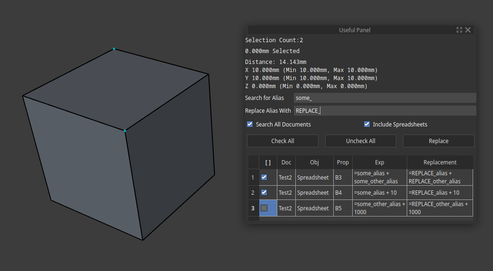

Freecad addon that does several useful things (am too lazy to create seperate addons):

- Provides current selection length.
- Provides distances between two selections (similar to Part Measure Linear).
	- plus additional X/Y/Z Min/Max measurements (i.e. the difference between the bounding edges of the selection). Sometimes the distance between two selections can be zero, but different size (e.g. two circles on top of eachother, but their diameters are different). The min/max distances show this.

- Provides a way to find and replace text in expressions. Either in all documents, or only the current. Can also optionally replace text in spreadsheets.
	- Incredibly useful if you have a lot of variables and like to rename things.
	- Has a preview of the replace text, and matches can be omitted via a checkbox.
	- **CAREFUL:** This is a simple text replacement, and the outputted expression is not guaranteed to be valid.

- Provides a way to export all "marked" objects. Marking is done by including the word "Export" in the part's `Label2` property.

### Notes:
- I suggest disabling loading partial documents if using replace in all documents. (`General => Document => Document objects => Disable partial loading of external linked objects`). I've not tested this with partially loaded docs and I've had problems with them with other addons so don't use partial loading.

### Todos:
	- [ ] At some point I would like to see if it's possible to move the measurements to the viewport a la Fusion360.
